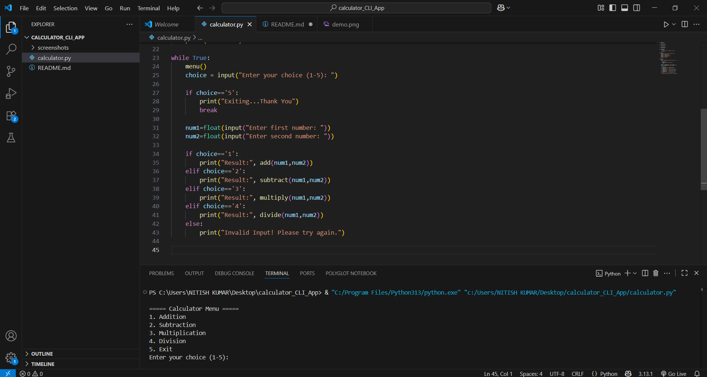
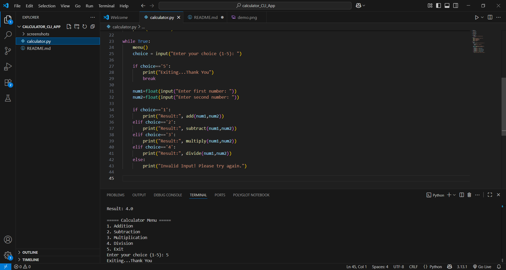

# Calculator CLI

This is a simple command-line calculator built in Python.  
It supports the following operations:
- Addition
- Subtraction
- Multiplication
- Division (with division by zero handling)

## How to Run
1. Make sure Python 3 is installed.
2. Open terminal in the project folder.
3. Run the script:
```bash
python calculator.py

===== Calculator Menu =====
1. Addition
2. Subtraction
3. Multiplication
4. Division
5. Exit

## Screenshots

### Menu


### Addition Example


### Exit

